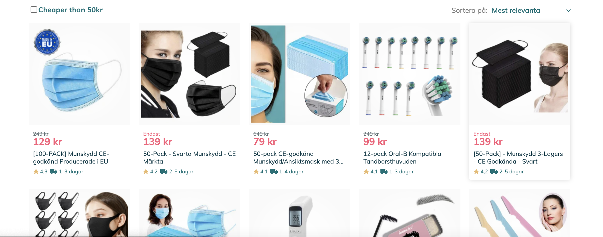
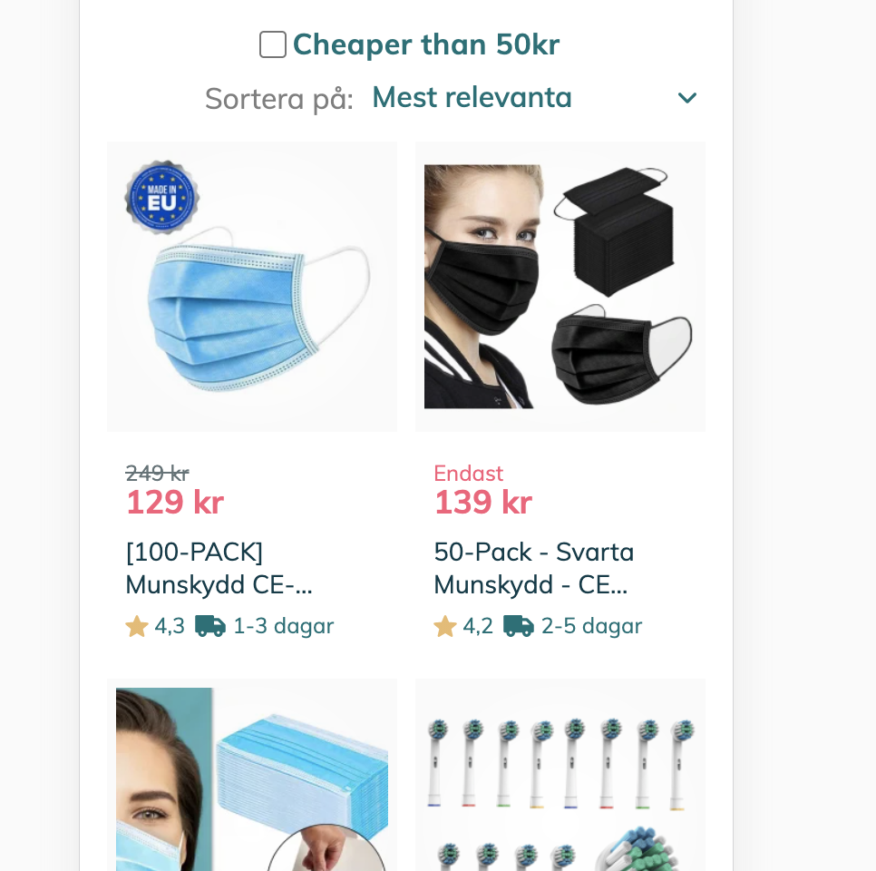

# Fyndiq-test starter kit

This project was bootstrapped with [Create React App](https://github.com/facebook/create-react-app).

**The purpose** of this repo is to provide you with a pre-configured repo to save time.

## Available Scripts

In the project directory, you can run:

### `yarn start`
or
### `npm start`

Runs the app in the development mode.\
Open [http://localhost:8080](http://localhost:8080) to view it in the browser.

The page will reload if you make edits.\
You will also see any lint errors in the console.

## Test assignment

Our Designer 🧞‍♀️ created a new view for our article list, your job is to build it using React.js. You will have **2-3 hours** to build what you have time for. **You do not need to finish the entire assignment**. For instance, you can skip implementing the ratings and delivery time elements on the article cards.

Desktop

Mobile

So, your main task is:
- **Implement cards and display them in the grid**
- **When the user applies filtering `Cheaper than 50kr`, show only articles with price less than 50kr**

And if you have time:
- **Add sorting functionality `by price` and `by rating`, ascending and descending order. "Mest relevanta" (relevance sorting) is the only sorting option provided by the API.**
- **Sort and filter should work together.**

### Important notes:
- API endpoint that provides dynamic data:

`https://shop-bff.fyndiq.se/code-assignment/articles`

- All assets (like truck, add button icon, star) can be found here -> https://fyndiq.se/halsa-skonhet/ . Feel free to inspect styles in the current implementation.

- On the live site you can find additional functionality (quick add button, different badges, etc). **You don't need to implement it**. Just focus on the design from the screenshots 

- Use any font you like. You can download the font from https://fonts.google.com/

- You can use any technology you like for styling.

- Spend **2-3 hours** on the test and build what you have time for. **You do not need to finish the entire assignment**. For instance, you can skip implementing the ratings and delivery time elements on the article cards.

### Consider the following topics for evaluation
* Code quality
* Responsiveness
* Semantics
